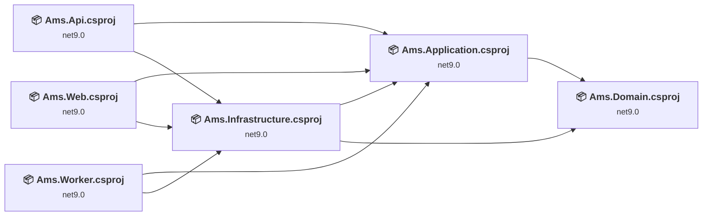
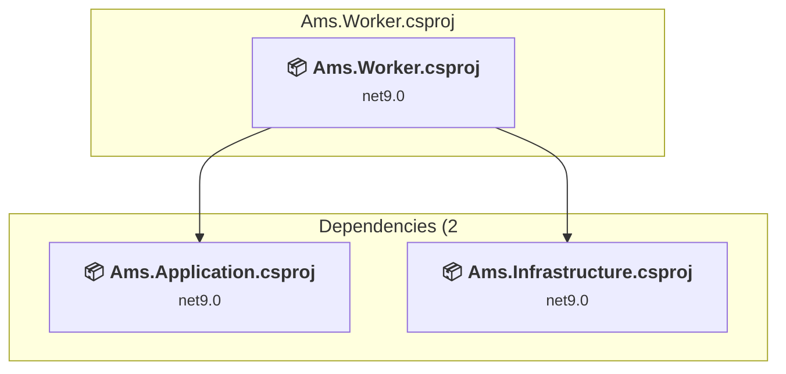
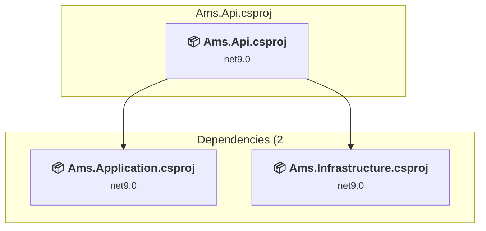
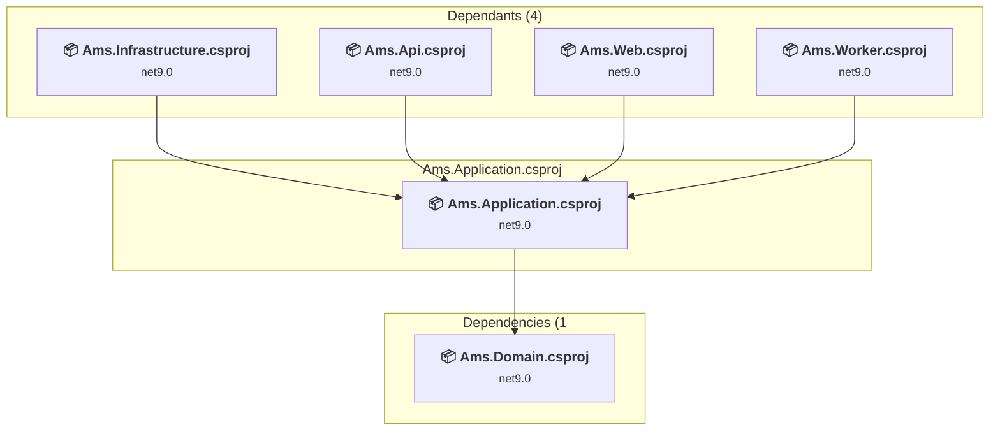
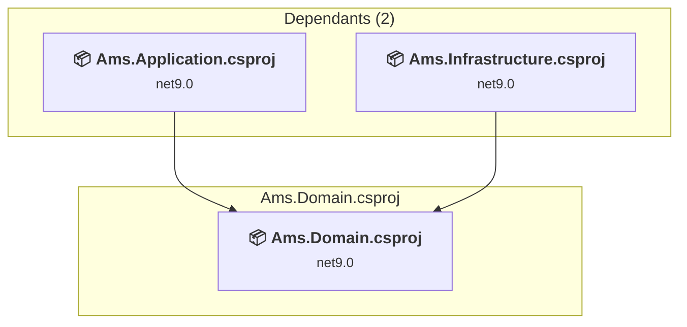
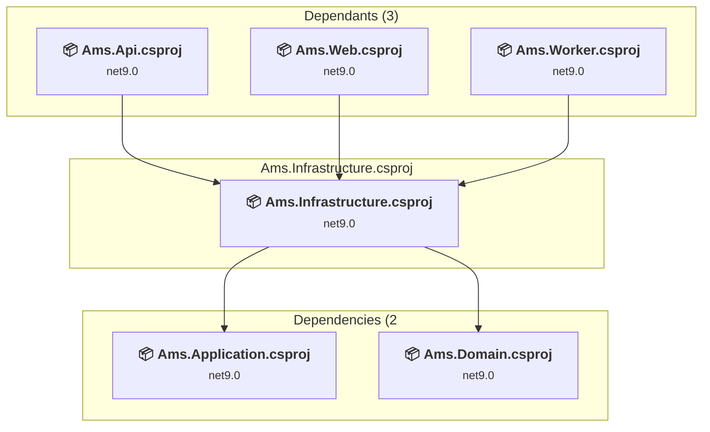
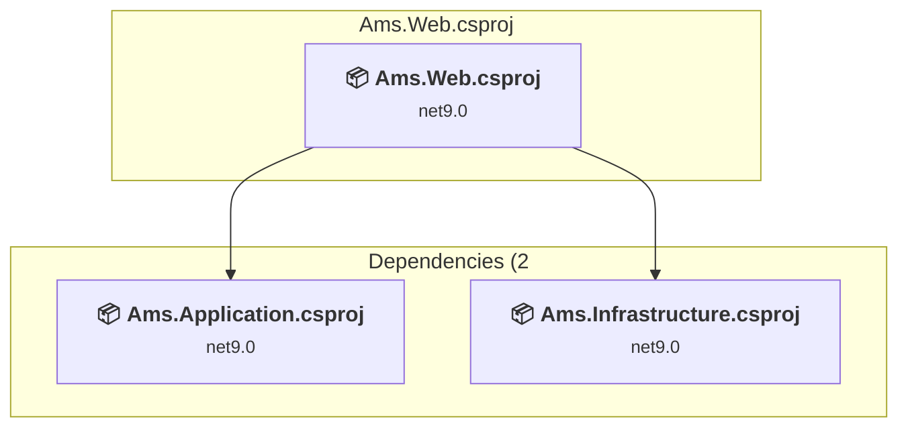

# Projects and dependencies analysis

This document provides a comprehensive overview of the projects and their dependencies in the context of upgrading to .NETCoreApp,Version=v10.0.

## Table of Contents

- [Executive Summary](#executive-Summary)
  - [Highlevel Metrics](#highlevel-metrics)
  - [Projects Compatibility](#projects-compatibility)
  - [Package Compatibility](#package-compatibility)
  - [API Compatibility](#api-compatibility)
  - [Binding Redirect Configuration](#binding-redirect-configuration)
- [Aggregate NuGet packages details](#aggregate-nuget-packages-details)
- [Top API Migration Challenges](#top-api-migration-challenges)
  - [Technologies and Features](#technologies-and-features)
  - [Most Frequent API Issues](#most-frequent-api-issues)
- [Projects Relationship Graph](#projects-relationship-graph)
- [Project Details](#project-details)

  - [Ams.Worker\Ams.Worker.csproj](#amsworkeramsworkercsproj)
  - [src\Ams.Api\Ams.Api.csproj](#srcamsapiamsapicsproj)
  - [src\Ams.Application\Ams.Application.csproj](#srcamsapplicationamsapplicationcsproj)
  - [src\Ams.Domain\Ams.Domain.csproj](#srcamsdomainamsdomaincsproj)
  - [src\Ams.Infrastructure\Ams.Infrastructure.csproj](#srcamsinfrastructureamsinfrastructurecsproj)
  - [src\Ams.Web\Ams.Web.csproj](#srcamswebamswebcsproj)

## Executive Summary

### Highlevel Metrics

| Metric | Count | Status |
| :--- | :---: | :--- |
| Total Projects | 6 | All require upgrade |
| Total NuGet Packages | 11 | 5 need upgrade |
| Total Code Files | 1811 |  |
| Total Code Files with Incidents | 224 |  |
| Total Lines of Code | 142859 |  |
| Total Number of Issues | 1171 |  |
| Estimated LOC to modify | 1160+ | at least 0.8% of codebase |

### Projects Compatibility

| Project | Target Framework | Difficulty | Package Issues | API Issues | Binding Issues | Est. LOC Impact | Description |
| :--- | :---: | :---: | :---: | :---: | :---: | :---: | :--- |
| [Ams.Worker\Ams.Worker.csproj](#amsworkeramsworkercsproj) | net9.0 | 🟢 Low | 1 | 30 | 0 | 30+ | DotNetCoreApp, Sdk Style = True |
| [src\Ams.Api\Ams.Api.csproj](#srcamsapiamsapicsproj) | net9.0 | 🟢 Low | 0 | 1 | 0 | 1+ | AspNetCore, Sdk Style = True |
| [src\Ams.Application\Ams.Application.csproj](#srcamsapplicationamsapplicationcsproj) | net9.0 | 🟢 Low | 0 | 6 | 0 | 6+ | ClassLibrary, Sdk Style = True |
| [src\Ams.Domain\Ams.Domain.csproj](#srcamsdomainamsdomaincsproj) | net9.0 | 🟢 Low | 0 | 0 | 0 |  | ClassLibrary, Sdk Style = True |
| [src\Ams.Infrastructure\Ams.Infrastructure.csproj](#srcamsinfrastructureamsinfrastructurecsproj) | net9.0 | 🟢 Low | 3 | 46 | 0 | 46+ | ClassLibrary, Sdk Style = True |
| [src\Ams.Web\Ams.Web.csproj](#srcamswebamswebcsproj) | net9.0 | 🟢 Low | 1 | 1077 | 0 | 1077+ | AspNetCore, Sdk Style = True |

### Package Compatibility

| Status | Count | Percentage |
| :--- | :---: | :---: |
| ✅ Compatible | 6 | 54.5% |
| ⚠️ Incompatible | 0 | 0.0% |
| 🔄 Upgrade Recommended | 5 | 45.5% |
| ***Total NuGet Packages*** | ***11*** | ***100%*** |

### API Compatibility

| Category | Count | Impact |
| :--- | :---: | :--- |
| 🔴 Binary Incompatible | 5 | High - Require code changes |
| 🟡 Source Incompatible | 165 | Medium - Needs re-compilation and potential conflicting API error fixing |
| 🔵 Behavioral change | 990 | Low - Behavioral changes that may require testing at runtime |
| ✅ Compatible | 1614640 |  |
| ***Total APIs Analyzed*** | ***1615800*** |  |

## Aggregate NuGet packages details

| Package | Current Version | Suggested Version | Projects | Description |
| :--- | :---: | :---: | :--- | :--- |
| Azure.Identity | 1.20.0 |  | [Ams.Infrastructure.csproj](#srcamsinfrastructureamsinfrastructurecsproj) | ✅Compatible |
| Azure.Storage.Blobs | 12.28.0 |  | [Ams.Infrastructure.csproj](#srcamsinfrastructureamsinfrastructurecsproj) | ✅Compatible |
| Dapper | 2.1.72 |  | [Ams.Infrastructure.csproj](#srcamsinfrastructureamsinfrastructurecsproj) | ✅Compatible |
| Microsoft.AspNetCore.SignalR.Client | 9.0.0 | 10.0.10 | [Ams.Web.csproj](#srcamswebamswebcsproj) | NuGet package upgrade is recommended |
| Microsoft.AspNetCore.SignalR.Core | 1.2.0 |  | [Ams.Api.csproj](#srcamsapiamsapicsproj) | ✅Compatible |
| Microsoft.Data.SqlClient | 7.0.0 |  | [Ams.Infrastructure.csproj](#srcamsinfrastructureamsinfrastructurecsproj) | ✅Compatible |
| Microsoft.Extensions.Configuration.Binder | 10.0.5 | 10.0.10 | [Ams.Infrastructure.csproj](#srcamsinfrastructureamsinfrastructurecsproj) | NuGet package upgrade is recommended |
| Microsoft.Extensions.DependencyInjection.Abstractions | 10.0.5 | 10.0.10 | [Ams.Infrastructure.csproj](#srcamsinfrastructureamsinfrastructurecsproj) | NuGet package upgrade is recommended |
| Microsoft.Extensions.Hosting | 10.0.0 | 10.0.10 | [Ams.Worker.csproj](#amsworkeramsworkercsproj) | NuGet package upgrade is recommended |
| Microsoft.Extensions.Logging.Abstractions | 10.0.5 | 10.0.10 | [Ams.Infrastructure.csproj](#srcamsinfrastructureamsinfrastructurecsproj) | NuGet package upgrade is recommended |
| Swashbuckle.AspNetCore | 10.0.1 |  | [Ams.Api.csproj](#srcamsapiamsapicsproj) | ✅Compatible |

## Top API Migration Challenges

### Technologies and Features

| Technology | Issues | Percentage | Migration Path |
| :--- | :---: | :---: | :--- |

### Most Frequent API Issues

| API | Count | Percentage | Category |
| :--- | :---: | :---: | :--- |
| T:System.Uri | 573 | 49.4% | Behavioral Change |
| T:System.Net.Http.HttpContent | 303 | 26.1% | Behavioral Change |
| T:System.Text.Json.JsonDocument | 88 | 7.6% | Behavioral Change |
| M:System.Threading.Tasks.Task.WhenAll(System.ReadOnlySpan{System.Threading.Tasks.Task}) | 51 | 4.4% | Source Incompatible |
| M:System.String.Join(System.Char,System.ReadOnlySpan{System.Object}) | 43 | 3.7% | Source Incompatible |
| M:System.String.Join(System.Char,System.ReadOnlySpan{System.String}) | 42 | 3.6% | Source Incompatible |
| M:System.Uri.#ctor(System.String) | 13 | 1.1% | Behavioral Change |
| M:System.TimeSpan.FromSeconds(System.Int64) | 10 | 0.9% | Source Incompatible |
| M:System.TimeSpan.FromMilliseconds(System.Int64,System.Int64) | 5 | 0.4% | Source Incompatible |
| M:System.Uri.TryCreate(System.String,System.UriKind,System.Uri@) | 5 | 0.4% | Behavioral Change |
| M:System.Uri.#ctor(System.Uri,System.String) | 3 | 0.3% | Behavioral Change |
| M:System.TimeSpan.FromHours(System.Int32) | 3 | 0.3% | Source Incompatible |
| M:Microsoft.Extensions.DependencyInjection.OptionsConfigurationServiceCollectionExtensions.Configure''1(Microsoft.Extensions.DependencyInjection.IServiceCollection,Microsoft.Extensions.Configuration.IConfiguration) | 3 | 0.3% | Binary Incompatible |
| P:System.Uri.AbsoluteUri | 2 | 0.2% | Behavioral Change |
| M:System.TimeSpan.FromHours(System.Double) | 2 | 0.2% | Source Incompatible |
| M:System.String.Split(System.ReadOnlySpan{System.Char}) | 2 | 0.2% | Source Incompatible |
| M:System.TimeSpan.FromMinutes(System.Int64) | 2 | 0.2% | Source Incompatible |
| M:Microsoft.Extensions.Configuration.ConfigurationBinder.Get''1(Microsoft.Extensions.Configuration.IConfiguration) | 2 | 0.2% | Binary Incompatible |
| M:Microsoft.Extensions.DependencyInjection.HttpClientFactoryServiceCollectionExtensions.AddHttpClient(Microsoft.Extensions.DependencyInjection.IServiceCollection,System.String) | 2 | 0.2% | Behavioral Change |
| T:System.Security.Cryptography.Rfc2898DeriveBytes | 1 | 0.1% | Source Incompatible |
| M:System.Security.Cryptography.Rfc2898DeriveBytes.Pbkdf2(System.String,System.Byte[],System.Int32,System.Security.Cryptography.HashAlgorithmName,System.Int32) | 1 | 0.1% | Source Incompatible |
| M:System.String.Join(System.String,System.ReadOnlySpan{System.String}) | 1 | 0.1% | Source Incompatible |
| M:System.String.Concat(System.ReadOnlySpan{System.Object}) | 1 | 0.1% | Source Incompatible |
| M:System.TimeSpan.FromDays(System.Int32) | 1 | 0.1% | Source Incompatible |
| M:Microsoft.AspNetCore.Builder.ExceptionHandlerExtensions.UseExceptionHandler(Microsoft.AspNetCore.Builder.IApplicationBuilder,System.String,System.Boolean) | 1 | 0.1% | Behavioral Change |

## Projects Relationship Graph

Legend:
📦 SDK-style project
⚙️ Classic project

## Project Details

### Ams.Worker\Ams.Worker.csproj

#### Project Info

- **Current Target Framework:** net9.0
- **Proposed Target Framework:** net10.0
- **SDK-style**: True
- **Project Kind:** DotNetCoreApp
- **Dependencies**: 2
- **Dependants**: 0
- **Number of Files**: 25
- **Number of Files with Incidents**: 11
- **Lines of Code**: 3132
- **Estimated LOC to modify**: 30+ (at least 1.0% of the project)

#### Dependency Graph

Legend:
📦 SDK-style project
⚙️ Classic project

### API Compatibility

| Category | Count | Impact |
| :--- | :---: | :--- |
| 🔴 Binary Incompatible | 1 | High - Require code changes |
| 🟡 Source Incompatible | 11 | Medium - Needs re-compilation and potential conflicting API error fixing |
| 🔵 Behavioral change | 18 | Low - Behavioral changes that may require testing at runtime |
| ✅ Compatible | 2765 |  |
| ***Total APIs Analyzed*** | ***2795*** |  |

### src\Ams.Api\Ams.Api.csproj

#### Project Info

- **Current Target Framework:** net9.0
- **Proposed Target Framework:** net10.0
- **SDK-style**: True
- **Project Kind:** AspNetCore
- **Dependencies**: 2
- **Dependants**: 0
- **Number of Files**: 205
- **Number of Files with Incidents**: 2
- **Lines of Code**: 18647
- **Estimated LOC to modify**: 1+ (at least 0.0% of the project)

#### Dependency Graph

Legend:
📦 SDK-style project
⚙️ Classic project

### API Compatibility

| Category | Count | Impact |
| :--- | :---: | :--- |
| 🔴 Binary Incompatible | 0 | High - Require code changes |
| 🟡 Source Incompatible | 0 | Medium - Needs re-compilation and potential conflicting API error fixing |
| 🔵 Behavioral change | 1 | Low - Behavioral changes that may require testing at runtime |
| ✅ Compatible | 29318 |  |
| ***Total APIs Analyzed*** | ***29319*** |  |

### src\Ams.Application\Ams.Application.csproj

#### Project Info

- **Current Target Framework:** net9.0
- **Proposed Target Framework:** net10.0
- **SDK-style**: True
- **Project Kind:** ClassLibrary
- **Dependencies**: 1
- **Dependants**: 4
- **Number of Files**: 1112
- **Number of Files with Incidents**: 3
- **Lines of Code**: 35249
- **Estimated LOC to modify**: 6+ (at least 0.0% of the project)

#### Dependency Graph

Legend:
📦 SDK-style project
⚙️ Classic project

### API Compatibility

| Category | Count | Impact |
| :--- | :---: | :--- |
| 🔴 Binary Incompatible | 0 | High - Require code changes |
| 🟡 Source Incompatible | 6 | Medium - Needs re-compilation and potential conflicting API error fixing |
| 🔵 Behavioral change | 0 | Low - Behavioral changes that may require testing at runtime |
| ✅ Compatible | 92269 |  |
| ***Total APIs Analyzed*** | ***92275*** |  |

### src\Ams.Domain\Ams.Domain.csproj

#### Project Info

- **Current Target Framework:** net9.0
- **Proposed Target Framework:** net10.0
- **SDK-style**: True
- **Project Kind:** ClassLibrary
- **Dependencies**: 0
- **Dependants**: 2
- **Number of Files**: 193
- **Number of Files with Incidents**: 1
- **Lines of Code**: 4977
- **Estimated LOC to modify**: 0+ (at least 0.0% of the project)

#### Dependency Graph

Legend:
📦 SDK-style project
⚙️ Classic project

### API Compatibility

| Category | Count | Impact |
| :--- | :---: | :--- |
| 🔴 Binary Incompatible | 0 | High - Require code changes |
| 🟡 Source Incompatible | 0 | Medium - Needs re-compilation and potential conflicting API error fixing |
| 🔵 Behavioral change | 0 | Low - Behavioral changes that may require testing at runtime |
| ✅ Compatible | 10080 |  |
| ***Total APIs Analyzed*** | ***10080*** |  |

### src\Ams.Infrastructure\Ams.Infrastructure.csproj

#### Project Info

- **Current Target Framework:** net9.0
- **Proposed Target Framework:** net10.0
- **SDK-style**: True
- **Project Kind:** ClassLibrary
- **Dependencies**: 2
- **Dependants**: 3
- **Number of Files**: 227
- **Number of Files with Incidents**: 7
- **Lines of Code**: 71824
- **Estimated LOC to modify**: 46+ (at least 0.1% of the project)

#### Dependency Graph

Legend:
📦 SDK-style project
⚙️ Classic project

### API Compatibility

| Category | Count | Impact |
| :--- | :---: | :--- |
| 🔴 Binary Incompatible | 0 | High - Require code changes |
| 🟡 Source Incompatible | 1 | Medium - Needs re-compilation and potential conflicting API error fixing |
| 🔵 Behavioral change | 45 | Low - Behavioral changes that may require testing at runtime |
| ✅ Compatible | 46426 |  |
| ***Total APIs Analyzed*** | ***46472*** |  |

### src\Ams.Web\Ams.Web.csproj

#### Project Info

- **Current Target Framework:** net9.0
- **Proposed Target Framework:** net10.0
- **SDK-style**: True
- **Project Kind:** AspNetCore
- **Dependencies**: 2
- **Dependants**: 0
- **Number of Files**: 754
- **Number of Files with Incidents**: 200
- **Lines of Code**: 9030
- **Estimated LOC to modify**: 1077+ (at least 11.9% of the project)

#### Dependency Graph

Legend:
📦 SDK-style project
⚙️ Classic project

### API Compatibility

| Category | Count | Impact |
| :--- | :---: | :--- |
| 🔴 Binary Incompatible | 4 | High - Require code changes |
| 🟡 Source Incompatible | 147 | Medium - Needs re-compilation and potential conflicting API error fixing |
| 🔵 Behavioral change | 926 | Low - Behavioral changes that may require testing at runtime |
| ✅ Compatible | 1433782 |  |
| ***Total APIs Analyzed*** | ***1434859*** |  |

